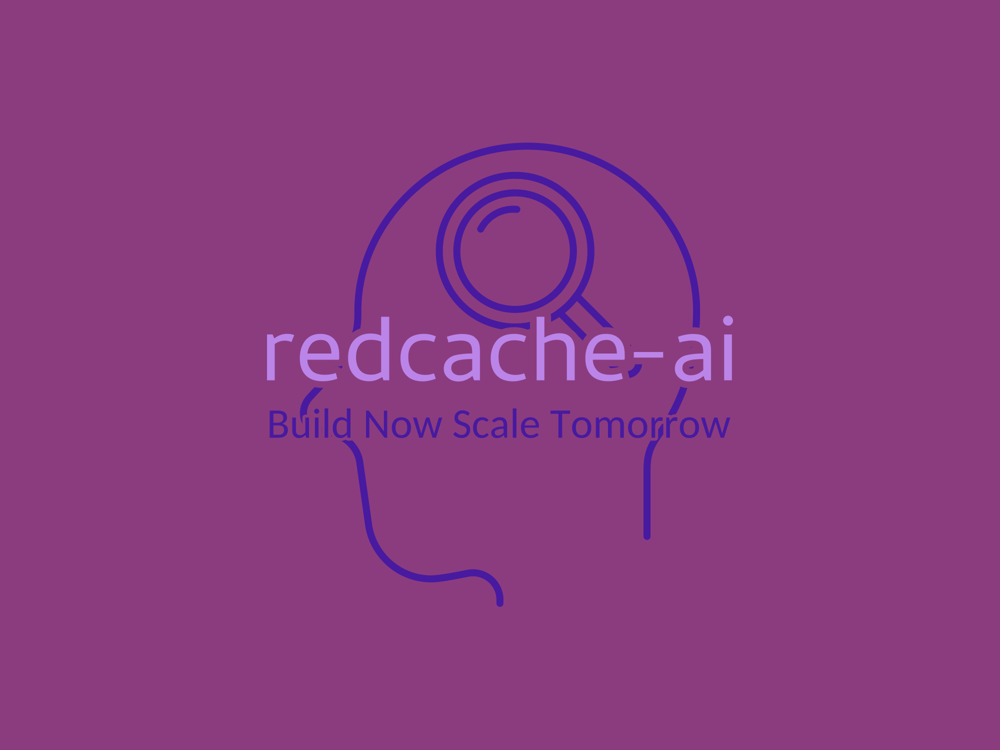

[Join the redcache-ai discord server](https://discord.com/channels/1267256745613328487/1267256818439163934) | [Email me](mailto:elementkalunga3@gmail.com)


**RedCache-ai: A memory framework for Large Language Models and Agents**
---
**What ?** 🤖
---
**REmote Dictionary cache - Artificial Intelligence (RedCache-AI)**. While developing a chat application, every solution I came across was either expensive, closed source or lacked extensive support for external dependencies. Redcache-ai provides a dynamic memory framework for Large Language Models, enabling developers to build wide ranging applications, from AI-powered dating apps to healthcare diagnostics platforms. 
 

**Quickstart** 😄
---
**Installation** <br>
---


**Initialize Redcache-ai** <br>
Redcache-ai provides two options. Initialize to disk or sqlite. By default redcache-ai initializes to disk. This where memories are stored. <br>

**Option 1: initialize to disk**<br>
Make sure to import all the required dependencies

```python
from redcache_ai import RedCache, load_config, set_openai_api_key

from redcache_ai.storage import DiskStorage, SQLiteStorage


storage = Disktorage()
```
**Option 2: Initialize to sqlite**
```python

storage = SQLiteStorage(db_path='my_cache.db')
```
**Store text as memory**<br>


**Note: the output visual representation below is for disk storage only. The input is the same for sqlite** 

**Input**
```python
memory_cache = storage.add("England is nice country", user_id = "James", metadata={"category": "facts"})
```
Output <br>


```python
{"James": {"7bbfbcbf-da9e-44ca-9cbb-ab558c64b36a": {"id": "7bbfbcbf-da9e-44ca-9cbb-ab558c64b36a", "text": "\"England is a nice country\"", "metadata": {"data": "\"England is a nice country\"", "category": "facts"}, "vector": [0.4472135954999579]}}}
```


**Retrieve Memory**
```python
# Get all memories
memories = storage(user_id = "James")
print(all_memories)

```

Output:
```python
# Get all memories
[
    {
        "id": "7bbfbcbf-da9e-44ca-9cbb-ab558c64b36a",
        "text": "England is a nice country",
        "metadata": {
            "category": "facts"
        }
    }
]


```

Search Memories
```python
# Get all memories
results = storage.search("country", user_id="James", num_results=1)
```
Output:

```python

[
    {
        "id": "7bbfbcbf-da9e-44ca-9cbb-ab558c64b36a",
        "text": "England is a nice country",
        "metadata": {
            "category": "facts"
        },
        "score": 0.849
    }
]
```

**Update Memory**
```Python
updated_memory = storage.update("7bbfbcbf-da9e-44ca-9cbb-ab558c64b36a", "England is a beautiful country", user_id="James") 
```
Output: 
```Python
{
    "id": "7bbfbcbf-da9e-44ca-9cbb-ab558c64b36a",
    "text": "England is a beautiful country",
    "metadata": {
        "category": "facts"
    }
}

```

**Delete Memory**
```python
storage.delete("7bbfbcbf-da9e-44ca-9cbb-ab558c64b36a", user_id="James")
```
Output:
```python
# No output, memory is deleted if successful

```


**Delete all memories**

```python
storage.delete_all(user_id="James")

```
```python
# No output, all memories for the user are deleted if successful 

```

**Enhance a memory using LLMs** 🔥 

**Large Langugae Model Integradtion**<br>
For now, redcache-ai only supports OpenAI. To integrate redcache-ai memories into openAI, you have to set an OPENAI API Key.

Once you have the key, you'll integrate your text memories like this:

```python
from redcache_ai.config import set_openai_api_key

set_openai_api_key("your-openai-api-key-here") 

``` 

```python
from redcache_ai import RedCache, load_config

# Load the default configuration
config = load_config()

# Initialize RedCache with OpenAI LLM
redcache = RedCache.from_config(config)
``` 
The output for load_config is below:
```python
{
    "llm": {
        "provider": "openai",
        "config": {
            "model": "gpt-4",
            "temperature": 0.2,
            "max_tokens": 1500,
        }
    }
}

```


```python
enhanced_memory = redcache.enhance_memory("England has a rich history", user_id="James", category="facts")
summary = redcache.generate_summary(user_id="James")

```
These examples demonstrate the basic usage of redcache-ai. For more detailed information and advanced features, please refer to the full documentation. If implementation details are unclear please see the test_redcache.py file in examples. For more information, visit the discord channel. <br>

**What's Next** ✈️<br>
Redcache-ai is still early. Priority is to fix any and all existing bugs. Improve documentation then: <br>
1.Add integration with more LLM providers including Llama, Mixtral, Claude etc. <br>
2.Add functionality for AI Agents. <br>
3.Provide support for a hosted version. <br>
Happy memory building. ❤️ 


